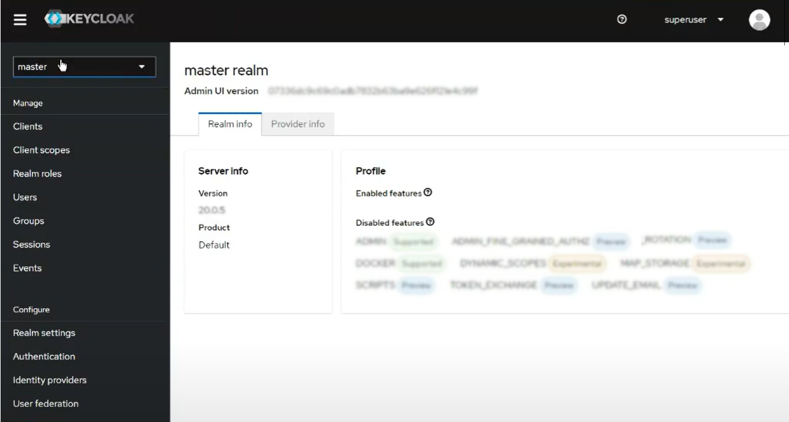

= Integrating with Optiva's API Gateway

== Table of Contents
* <<Overview>>
* <<Getting Started>>
* <<Configuring Keycloak for User Authentication>>
* <<Request Sequencing for Complex Workflows>>

== Overview
Optiva's API gateway enables integrators to leverage the power of Optiva's BSS and Customer Management solutions with third-party applications.

Optiva's API gateway has the three following API Specifications:

* *cmsapigw-swagger -* Optiva's Customer Management API, which includes a series of requests that allow third-party applications to offer the functionality of Optiva's Customer Management Portal. 

* *obp-rtr-apigw -* Optiva's BSS API (REST to REST), which includes a series of requests to interact with Optiva's BSS.   

* *obp-rts-apigw -* Optiva's BSS API (REST to SOAP), which includes a series of requests to interact with Optiva's BSS. 

Optiva's API leverages endpoints that are goal-oriented and that can be used either individually or as part of a more complex workflow.

*Note:* Optiva's API specifications are hollistic and include both requests that can be integrated against by third parties as well as requests that are only for Optiva's use.

== Getting Started

Optiva's API gateway uses Keycloak for authentication of requests.

=== Introduction to Keycloak

https://www.keycloak.org/[Keycloak] is used to provide the identity management module for secure access between applications within OBP.

Keycloak provides Single Sign-On (SSO) capability, Identity Brokering, User Federation, and Authorization Services. Keycloak supports external IDPs such as LDAP or ADP via User Federation and SSO redirect for OIDC & SAML logins via Identity Brokering.

A Keycloak instance is deployed into the *Infra* cluster as part of the OBP deployment pipeline.

=== Keycloak Configuration Overview

To setup Keycloak for use with Optiva's APIs, you must perform the following tasks:

. <<Identifying the Keycloak Admin Account>>

. <<Creating a Keycloak Realm>>

. <<Creating a Keycloak User>>

. <<Creating Keycloak Client Realm Roles for Interacting with the Customer Management Database>>

. <<Creating a Keycloak User Account for Interacting with the Customer Management Database>>

. <<Creating a Client and Users for API Gateway Access>>

.. <<Creating a BSS User Account for an API Gateway>>

.. <<Creating Keycloak Client Scopes for API Gateway>>

.. <<Creating Keycloak Client for API Gateway>>

.. <<Creating a Keycloak User Account for an API Gateway>>

== Configuring Keycloak for User Authentication

=== Identifying the Keycloak Admin Account

During Keycloak installation an administrator account was created and this account is used as a super admin with full permissions to manage Keycloak. You can log into the Keycloak Admin Console to create realms, clients and users with an administrator account.

The credentials for the admin account are detailed in the _keycloak/values-cms.${env}.yaml_ 
file used during the installation.

For more information on an admin account see https://www.keycloak.org/docs/latest/server_admin/#creating-first-admin_server_administration_guide[the official Keycloak documentation].

=== Creating a Keycloak Realm

A Keycloak realm is where objects such as users, applications, roles, and groups are managed. The API User will be assigned to and is able to log into a realm.

==== Prerequisite
* You will need the login credentials for the Keycloak administrator account created during deployment. For more information on an admin account https://www.keycloak.org/docs/latest/server_admin/#creating-first-admin_server_administration_guide[follow this link to the Keycloak documentation].

==== Procedure
For steps to create a new realm, https://www.keycloak.org/docs/latest/server_admin/#configuring-realms[follow this link to the official procdure on the Keycloak website].

=== Creating a Keycloak User

A Keycloak User represents a person that can access applications using Keycloak. A User will have personal associated attributes, for example email and home address. Users can be assigned group membership and can have specific roles assigned to them.

A User is created within the Customer Management realm and is granted access to multiple applications using Keycloak clients.

==== Prerequisite
* You must know the login credentials for the Keycloak administrator account created during deployment. For more information on an admin account https://www.keycloak.org/docs/latest/server_admin/#creating-first-admin_server_administration_guide[follow this link to the Keycloak documentation].

* You must have created the Customer Management realm as described in <<Creating a Keycloak Realm>>.

==== Procedure

For steps to create a new User, follow the procedure in https://www.keycloak.org/docs/latest/server_admin/#proc-creating-user_server_administration_guide[the official Keycloak documentation].

=== Creating Keycloak Client Realm Roles for Interacting with the Customer Management Database

Keycloak roles provide a type or a category for a User such as admin, user, manager, and employee. All are typical roles that may exist in an organization.

The following configuration creates the required realm roles for interacting with the Customer Management Database.

==== Prerequisite

* You must be logged into the Keycloak UI using the admin login credentials.

==== Configuration

Use the following parameters to create the general realm roles for the Customer Management Portal. For the full procedure see https://www.keycloak.org/docs/latest/server_admin/#proc-creating-realm-roles_server_administration_guide[the official Keycloak documentation]:

[cols="1,1"]
|===
|*Role Name*
|*Description*

|_csr-all-customer-operations_
|To create/delete/view a customer and access customer’s dashboard.

|_csr-spid2-admin_
|To create/delete/view/update all entities and access their dashboards.

|_csr-all-operations_
|To create/delete/view and access dashboard of all entities.
|===

Use the following parameters to create the service provider realm roles for interacting with the Customer Management database. This set of roles should be recreated for each service provider configured in Customer Management, modify the SPID number for each additional set. For the full procedure https://www.keycloak.org/docs/latest/server_admin/#proc-creating-realm-roles_server_administration_guide[see the official Keycloak documentation]:

[cols="1,1"]
|===
|*Role Name*
|*Description*

|_1:*:*_
|Permission to access/view/create/delete/update all entities and view SPID1 dashboard.

|_1:admin_
|Permission to perform admin tasks for SPID 1.

|_1:approveAdjsutment:*_
|Permission to approve adjustments for SPID 1.

|_1:billingAccount:get_
|Permission to access/view billing account details and its dashboard.

|_1:billingAccount:patch_
|Permission to update billing account details.

|_1:billingAccount:post_
|Permission to create new billing account.

|_1:billingAccount:delete_
|Permission to delete a billing account.

|_1:billingAccount:*_
|Permission to create/delete/view/ update billingAccount and access its dashboard.

|_1:individual:get_
|Permission to access/view individual details.

|_1:individual:patch_
|Permission to update individual details.

|_1:individual:post_
|Permission to create new individual.

|_1:individual:delete_
|Permission to delete a individual.

|_1:individual:*_
|Permission to create/delete/view/update individual customers and access its dashboard.

|_1:customer:get_
|Permission to access/view customer details and its dashboard.

|_1:customer:patch_
|Permission to update customer details.

|_1:customer:post_
|Permission to create new customer.

|_1:customer:delete_
|Permission to delete a customer.

|_1:customer:*_
|Permission to create/delete/view/update individual customers and access its dashboard.

|_1:serviceProvider:get_
|Permission to access/view service provider details.

|_1:serviceProvider:patch_
|Permission to update service provider details.

|_1:serviceProvider:post_
|Permission to create new service provider.

|_1:allEntity:get_
|Permission to search in all entities.

|_1:dashboard:get_
|Permission to view main CSR dashboard.

|_1:exportData:*_
|Permission to export table data from an entry list page.
|===

*Note:* Any of the realm roles created above can be enhanced as a composite role. This applies additional controls for the operations, a User can perform in the Customer Management Portal. For more details on composite roles see https://www.keycloak.org/docs/latest/server_admin/#_composite-roles[the official Keycloak documentation].

=== Creating a Keycloak User Account for Interacting with the Customer Management Database

A Keycloak user account must be created for each application that will interact with the Customer Management database.

==== Prerequisites

* You must be logged into the Keycloak UI using the admin login credentials.

* You must know the email address and birth name of the new User.

* You must know the SPID value to be assigned to the User.

* You must have created the roles and permissions to assigned to the User as described in <<Creating Keycloak Client Realm Roles for Interacting with the Customer Management Database>>.

==== Configuration

Use the following parameters to create a User that can access the Customer Management Portal. For the full procedure see https://www.keycloak.org/docs/latest/server_admin/#proc-creating-user_server_administration_guide[the official Keycloak documentation]:

* *Create User* screen:

** *Username -* Enter the user name into the text box.

** *Email -* Enter the responsible email address into the text box.

** *Email verified -* Set the toggle to *On*.

** *First name -* Enter first name of the responsible POC into the text box.

** *Last name -* Enter birth last name of the responsible POC into the text box.

Once created, edit the User to apply the following configurations:

* *Attributes* tab - Populate the *Key* and *Value* parameters as follows:

[cols='1,1']
|===
|*Key*
|*Value*

|_availableSpids_
|This value is the SPID and name of the service provider that the User has access too, for example

_1:HappyPhone._

*Note:* Add this key and value pairing must be added for each service providers that the User requires access too.

|_allowCsrToManageMonthlySpendLimit_
|This value can be either of the following:

* _True_ -The User can modify subscription monthly spend limits.

* _False_ - The User cannot modify subscription monthly spend limits.

|_allowCsrToManageCreditLimit_
|This value can be either of the following:

* _True_ - The User can modify subscription credit limits.

* _False_ - The User cannot modify subscription credit limits.
|===

* *Credentials* tab:

** *Password -* Enter the initial password for the user credential login.

** *Password confirmation -* Enter the same initial password to confirm correct entry.

** *Temporary -* Set the toggle to *On*.

* *Role Mapping* tab:

** *Assign Role -* Assign the required roles from the pop-up window. Multiple roles can be selected.

=== Creating a Client and Users for API Gateway Access

Each external application making requests to OBP using the API gateway must have a Keycloak User accounts.

The following methods are used to authenticate an external application:

. *Keycloak Roles -* The CM client roles must be added to the user account. For more details on configuring the roles see <<Creating Keycloak Client Realm Roles for Interacting with the Customer Management Database>>.

. *Keycloak Scopes -* The API Gateway scopes must be added to the user account. For more details on configuring the scopes see <<Creating Keycloak Client Scopes for API Gateway>>.

==== Configuration

The following configuration is required:

* <<Creating a BSS User Account for an API Gateway>>

* <<Creating Keycloak Client Scopes for API Gateway>>

* <<Creating Keycloak Client for API Gateway>>

* <<Creating a Keycloak User Account for an API Gateway>>

==== Creating a BSS User Account for an API Gateway

===== Task

Steps to create an API gateway User in AppCrm.

===== Context

An AppCrm User must be created to authenticate API requests from the API gateway.

===== Procedure

Use the following parameters to create an API gateway User. For the full procedure see the _Billing Support System User Guide_.

* *User ID -* Enter 'service-account' into the text box.

* *Group -* Select *Redknee Admin* from the dropdown list.

* *Service Provider -* Select *0 - Super Spid* from the dropdown list.

==== Creating Keycloak Client Scopes for API Gateway

Client scopes are used to create shared configurations across all Users. A scope defines a token mapper that includes user attributes and roles that are shared in generated authentication tokens.

The following configuration creates a client scope and token mapper to represent external application access to the API gateway.

===== Prerequisites
* You must be logged into the Keycloak UI using the admin login credentials.

===== Configuration
Use the following table of parameters to create the client scopes for the API Gateway. For the full procedure see https://www.keycloak.org/docs/latest/server_admin/#_client_scopes[the official Keycloak documentation]:

[cols='1,1,1,2']
|===
|*Name*
|*Type*
|*Protocol*
|*Inclue in Token Scope*

|obp-apigw:admin	
|Default
|OpenID Connect	
|Yes

|obp-apigw:read	
|Default
|OpenID Connect	
|Yes

|obp-apigw:write	
|Default
|OpenID Connect	
|Yes
|===

==== Creating Keycloak Client for API Gateway

A Keycloak client is required to allow Keycloak to authenticate API Gateway requests using SSO.

===== Prerequisites

* You must be logged into the Keycloak UI using the admin login credentials.

* You must create the client within the Keycloak realm created in Create a Keycloak Realm.

* You must have created the client scopes for API Gateway as described in Creating Keycloak Client Scopes for API Gateway.

* You must know the URL of the Keycloak UI.

* You must know the root URL and host URL of the API Gateway in the deployment.

===== Configuration
. Use the following parameters to create the API Gateway client. For the full procedure see the official keycloak documentation:

* *Client type -* Select *OpenID Connect* from the dropdown list.

* *Client ID -* Enter a unique identifier, for example 'obp-apigw' into the text box. This is a required field.

* *Always Display in UI* - Set the toggle to *Off*.

* *Root URL -* Enter the root URL into the text box, for example of 'http://localhost:3000'.

* *Home URL -* Enter the home URL into the text box, for example 'http://keycloak.cm.portal.obp:8080/*'.

* *Valid redirect URLs -* Enter '*' into the text box.

* *Client authentication -* Set the toggle to *On*.

* *Authentication Flow -* Check the following checkboxes:

** *Standard flow*

** *Implicit flow*

** *Direct access grants*

** *Service accounts roles*

. Click *Client Scopes* and add the API Gateway client scopes created previously, for the full procedure see the official Keycloak documentation. Ensure the *Assign Type* parameter is set to *default* for all added scopes.

. You must set the *Access Token Lifespan* to '1 hour', for more details see the official keycloak documentation.

. You must activate the *Use JWKS URL* parameter, for more details see the official keycloak documentation.

==== Creating a Keycloak User Account for an API Gateway

A Keycloak user account must be created for each external application that will send request to OBP via the API gateway.

===== Prerequisites

* You must be logged into the Keycloak UI using the admin login credentials.

* You must know the email address and birth name of the new User.

* You must know the SPID value to be assigned to the User.

* You must have created the BSS user account for the external application as described in <<Creating a BSS User Account for an API Gateway>>.

* You must have created the roles and permissions to be added to the User as described in <<Creating Keycloak Client Realm Roles for Interacting with the Customer Management Database>>.

===== Configuration
Use the following parameters to create a User that can access the API Gateway. For the full procedure see https://www.keycloak.org/docs/latest/server_admin/#proc-creating-user_server_administration_guide[the official Keycloak documentation]:

* *Create User* screen:

** *Username -* Enter the user name into the text box.

** *Email -* Enter the responsible email address into the text box.

** *Email verified -* Set the toggle to *On*.

** *First name -* Enter first name of the responsible POC into the text box.

** *Last name -* Enter birth last name of the responsible POC into the text box.

* Add the CM roles created previously to the User account. For the procedure to add roles see https://www.keycloak.org/docs/latest/server_admin/#proc-assigning-role-mappings_server_administration_guide+[the official Keycloak documentation].

== Request Sequencing for Complex Workflows

Paragraph to cover how requests can acheive single goals or be stitched together into a more complex user journeys.

=== Provisioning a New Subscriber

To have an active Subscription, subscribers must be associated with an Account, which in turn must be associated with a Customer and a Party. To add a new Subscription to an Account, use the _productOrder_ endpoint.

There are two methods to provision a new subscriber if an Account entity, a Customer entity, and a Party entity are also needed: 

* Using the _quickPrepaidBillingAccount_ endpoint. When using this endpoint, Customer Management creates a corresponding Party and Customer for the new Account. You can then create a new Subscription for the newly created Account

* Creating each entity using the following endpoints, and then creating a new Subscription for the newly created Account:

** _individual_

** _customer_

** _billingAccount_

[cols="1,1,2,1,2"]
|===
|*User Journey*
|*API Specification*
|*Sequence*
|*Request Type*
|*Notes*

|Provisioning a New Subscriber using the _quickPrepaidBillingAccount_ endpoint
|link:./cmsapigw-swagger.yml[cmsapigw.swagger]
|1. _/api/quickPrepaidBillingAccount_
|POST
|-

|
|link:./cmsapigw-swagger.yml[cmsapigw.swagger]
|2. _/api/productOrder_
|POST 
|You need to include the Account's _id_ with this request 

|Provisioning a New Subscriber using the _individual_, _customer_, and _billingAccount_ endpoints
|link:./cmsapigw-swagger.yml[cmsapigw.swagger]
|1. _/api/individual_
|POST
|-

|
|link:./cmsapigw-swagger.yml[cmsapigw.swagger]
|2. _/api/customer_
|POST
|You need to include the Party's _id_ and _href_ with this request

|
|link:./cmsapigw-swagger.yml[cmsapigw.swagger]
|3. _/api/billingAccount_
|POST
|You need to include the Customer's _id_ and _href_ with this request

|
|link:./cmsapigw-swagger.yml[cmsapigw.swagger]
|4. _/api/productOrder_
|POST 
|You need to include the Account's _id_ with this request 

|Adding a Stored Payment Method to a Subscriber
|link:./cmsapigw-swagger.yml[cmsapigw.swagger]
|1. Create the Account as described in the previous user journeys
|-
|-

|
|Refer to Payment Gateway API documentation
|2. Aquire the Acoount's _tokenValue_ from your integrated payment gateway.
|-
|-

|
|link:./cmsapigw-swagger.yml[cmsapigw.swagger]
|3. _/api/paymentGatewayIntegration/createToken_
|POST
|You need to sent the Account's _tokenValue_ with this request

|
|link:./cmsapigw-swagger.yml[cmsapigw.swagger]
|4. _/api/paymentMethod_
|POST
|You need to send the _tokenValue_ as well as the last four digits of the credit or debit card and the card's expiry date.

*Note:* For payment gateways like PayPal that use a user credential as reference for the _tokenValue_ we recommend sending the following dummy values:

- _maskedCardNumber_ - We recommend using '1111'

- _expiryDate_ - We recommend using '2200/01'

|Adding a Stored Payment Method to a Subscriber and Adding an Automatic Top Up (ATU)
|link:./cmsapigw-swagger.yml[cmsapigw.swagger]
|1. Create the Account as described in the previous user journeys
|-
|-

|
|Refer to Payment Gateway API documentation
|2. Aquire the Account's _tokenValue_ from your integrated payment gateway.
|-
|-

|
|link:./cmsapigw-swagger.yml[cmsapigw.swagger]
|3. _/api/paymentGatewayIntegration/createToken_
|POST
|You need to sent the Account's _tokenValue_ with this request

|
|link:./cmsapigw-swagger.yml[cmsapigw.swagger]
|4. _/api/paymentMethod_
|POST
|You need to send the _tokenValue_ as well as the last four digits of the credit or debit card and the card's expiry date.

*Note:* For payment gateways like PayPal that use a user credential as reference for the _tokenValue_ we recommend sending the following dummy values:

- _maskedCardNumber_ - We recommend using '1111'

- _expiryDate_ - We recommend using '2200/01'

|
|link:./cmsapigw-swagger.yml[cmsapigw.swagger]
|5. _/api/productOrder_
|POST
|You need to send the _atuTokenID_ and _atuAmount_ parameters with this request. The value for the _atuTokenID_ is the _tokenID_ for the Account's stored Payment Method.

|===

=== Mobile Number Porting

Mobile Number Portability allows Subscribers to move their mobile number from one service provider to another. This is possible only when the Subscriber's number is eligible for Port In to the new service provider's system. For more information, see the _/api/mnp/eligibility_ endpoint in link:./cmsapigw-swagger.yml[cmsapigw.swagger].

=== Managing Entities

[cols="1,1,1,1,1"]
|===
|*User Journey*
|*API Specification*
|*Sequence*
|*Request Type*
|*Notes*

|User Journey 1
|Cell in column 2, row 2
|Cell in column 1, row 2
|Cell in column 2, row 2
|Cell in column 1, row 3

|
|Cell in column 2, row 3 
|Cell in column 2, row 3 
|Cell in column 2, row 3 
|Cell in column 2, row 3 

|User Journey 2
|Cell in column 2, row 2
|Cell in column 1, row 2
|Cell in column 2, row 2
|Cell in column 1, row 3
|===
=== Managing Party Interactions

[cols="1,1,1,1,1"]
|===
|*User Journey*
|*API Specification*
|*Sequence*
|*Request Type*
|*Notes*

|User Journey 1
|Cell in column 2, row 2
|Cell in column 1, row 2
|Cell in column 2, row 2
|Cell in column 1, row 3

|
|Cell in column 2, row 3 
|Cell in column 2, row 3 
|Cell in column 2, row 3 
|Cell in column 2, row 3 

|User Journey 2
|Cell in column 2, row 2
|Cell in column 1, row 2
|Cell in column 2, row 2
|Cell in column 1, row 3
|===
=== Adding Notes to Accounts and Subscriptions

[cols="1,1,1,1,1"]
|===
|*User Journey*
|*API Specification*
|*Sequence*
|*Request Type*
|*Notes*

|User Journey 1
|Cell in column 2, row 2
|Cell in column 1, row 2
|Cell in column 2, row 2
|Cell in column 1, row 3

|
|Cell in column 2, row 3 
|Cell in column 2, row 3 
|Cell in column 2, row 3 
|Cell in column 2, row 3 

|User Journey 2
|Cell in column 2, row 2
|Cell in column 1, row 2
|Cell in column 2, row 2
|Cell in column 1, row 3
|===
=== Using Payment Schedules

Payment Schedules provide the mechanism to charge to an Account's saved payment method at a future date and time and can be used to apply Automatic Top Up (ATU) to prepaid subscriptions.

Note: When applying ATU to a prepaid subscription during the onboarding process, use the _/api/productOrder_ endpoint and send the _atuTokenID_ and _atuAmount_ parameters.

[cols="1,1,1,1,1"]
|===
|*User Journey*
|*API Specification*
|*Sequence*
|*Request Type*
|*Notes*

|Applying ATU to an Existing Prepaid Subscription
|link:./cmsapigw-swagger.yml[cmsapigw.swagger]
|1. _/api/paymentGatewayIntegration/createSchedule_
|POST
|You need to send the ID of the Account's payment token with this request

|Cancelling ATU for a Prepaid Subscription
|link:./cmsapigw-swagger.yml[cmsapigw.swagger]
|1. _/api/paymentGatewayIntegration/deleteSchedule_
|DELETE
|You need to send the _scheduleID_ with this request

|Changing the ATU for a Prepaid Subscription
|link:./cmsapigw-swagger.yml[cmsapigw.swagger]
|1. _/api/paymentGatewayIntegration/deleteSchedule_
|DELETE
|You need to send the _scheduleID_ with this request

|
|link:./cmsapigw-swagger.yml[cmsapigw.swagger]
|2. _/api/paymentGatewayIntegration/createSchedule_
|POST
|You need to send the ID of the Account's payment token with this request

|
|link:./cmsapigw-swagger.yml[cmsapigw.swagger]
|2. _
|===
=== Managing Payment Methods

Payment methods provide the mechanism to retrieve Account payment information, debit card or credit card details, from an external payment gateway to ensure your system is compliant with the Payment Card Industry Data Security Standards (PCI DSS).

Customer Management stores the authentication credentials to retrieve payment method details for individual Accounts. None of the sensitive payment method details are stored in Customer Management.

*Note:* An Account can have only one stored payment method at any time.

[cols="1,1,1,1,1"]
|===
|*User Journey*
|*API Specification*
|*Sequence*
|*Request Type*
|*Notes*

|Adding a Stored Payment Method for an Account
|Refer to Payment Gateway API documentation
|1. Aquire the Acoount's _tokenValue_ from your integrated payment gateway.
|-
|-

|
|link:./cmsapigw-swagger.yml[cmsapigw.swagger]
|2. _/api/paymentGatewayIntegration/createToken_
|POST
|You need to sent the Account's _tokenValue_ with this request

|
|link:./cmsapigw-swagger.yml[cmsapigw.swagger]
|3. _/api/paymentMethod_
|POST
|You need to send the _tokenValue_ as well as the last four digits of the credit or debit card and the card's expiry date.

*Note:* For payment gateways like PayPal that use a user credential as reference for the _tokenValue_ we recommend sending the following dummy values:

- _maskedCardNumber_ - We recommend using '1111'

- _expiryDate_ - We recommend using '2200/01'

|Updating the Stored Payment Method for an Account
|Refer to Payment Gateway API documentation
|1. Aquire the Acoount's _tokenValue_ from your integrated payment gateway.
|-
|-

|
|link:./cmsapigw-swagger.yml[cmsapigw.swagger]
|2. _/api/paymentGatewayIntegration/createToken_
|POST
|You need to sent the Account's _tokenValue_ with this request

|
|link:./cmsapigw-swagger.yml[cmsapigw.swagger]
|3. _/api/paymentMethod{id}_
|PATCH
|You need to send the _tokenValue_ as well as the last four digits of the credit or debit card and the card's expiry date.

*Note:* For payment gateways like PayPal that use a user credential as reference for the _tokenValue_ we recommend sending the following dummy values:

- _maskedCardNumber_ - We recommend using '1111'

- _expiryDate_ - We recommend using '2200/01'

|Deleting the Stored Payment Method for an Account
|link:./cmsapigw-swagger.yml[cmsapigw.swagger]
|1._/api/paymentMethod/{id}_
|DELETE
|-
|===
=== Using Refer a Friend Bonuses

[cols="1,1,1,1,1"]
|===
|*User Journey*
|*API Specification*
|*Sequence*
|*Request Type*
|*Notes*

|User Journey 1
|Cell in column 2, row 2
|Cell in column 1, row 2
|Cell in column 2, row 2
|Cell in column 1, row 3

|
|Cell in column 2, row 3 
|Cell in column 2, row 3 
|Cell in column 2, row 3 
|Cell in column 2, row 3 

|User Journey 2
|Cell in column 2, row 2
|Cell in column 1, row 2
|Cell in column 2, row 2
|Cell in column 1, row 3
|===
=== Adding Products to a Subscription

[cols="1,1,1,1,1"]
|===
|*User Journey*
|*API Specification*
|*Sequence*
|*Request Type*
|*Notes*

|User Journey 1
|Cell in column 2, row 2
|Cell in column 1, row 2
|Cell in column 2, row 2
|Cell in column 1, row 3

|
|Cell in column 2, row 3 
|Cell in column 2, row 3 
|Cell in column 2, row 3 
|Cell in column 2, row 3 

|User Journey 2
|Cell in column 2, row 2
|Cell in column 1, row 2
|Cell in column 2, row 2
|Cell in column 1, row 3
|===
=== Changing a Subscription Plan

[cols="1,1,1,1,1"]
|===
|*User Journey*
|*API Specification*
|*Sequence*
|*Request Type*
|*Notes*

|User Journey 1
|Cell in column 2, row 2
|Cell in column 1, row 2
|Cell in column 2, row 2
|Cell in column 1, row 3

|
|Cell in column 2, row 3 
|Cell in column 2, row 3 
|Cell in column 2, row 3 
|Cell in column 2, row 3 

|User Journey 2
|Cell in column 2, row 2
|Cell in column 1, row 2
|Cell in column 2, row 2
|Cell in column 1, row 3
|===
=== Managing Offers

[cols="1,1,1,1,1"]
|===
|*User Journey*
|*API Specification*
|*Sequence*
|*Request Type*
|*Notes*

|User Journey 1
|Cell in column 2, row 2
|Cell in column 1, row 2
|Cell in column 2, row 2
|Cell in column 1, row 3

|
|Cell in column 2, row 3 
|Cell in column 2, row 3 
|Cell in column 2, row 3 
|Cell in column 2, row 3 

|User Journey 2
|Cell in column 2, row 2
|Cell in column 1, row 2
|Cell in column 2, row 2
|Cell in column 1, row 3
|===
=== Blocking a SIM

[cols="1,1,1,1,1"]
|===
|*User Journey*
|*API Specification*
|*Sequence*
|*Request Type*
|*Notes*

|User Journey 1
|Cell in column 2, row 2
|Cell in column 1, row 2
|Cell in column 2, row 2
|Cell in column 1, row 3

|
|Cell in column 2, row 3 
|Cell in column 2, row 3 
|Cell in column 2, row 3 
|Cell in column 2, row 3 

|User Journey 2
|Cell in column 2, row 2
|Cell in column 1, row 2
|Cell in column 2, row 2
|Cell in column 1, row 3
|===
=== Using a Shopping Cart

[cols="1,1,1,1,1"]
|===
|*User Journey*
|*API Specification*
|*Sequence*
|*Request Type*
|*Notes*

|User Journey 1
|Cell in column 2, row 2
|Cell in column 1, row 2
|Cell in column 2, row 2
|Cell in column 1, row 3

|
|Cell in column 2, row 3 
|Cell in column 2, row 3 
|Cell in column 2, row 3 
|Cell in column 2, row 3 

|User Journey 2
|Cell in column 2, row 2
|Cell in column 1, row 2
|Cell in column 2, row 2
|Cell in column 1, row 3
|===
